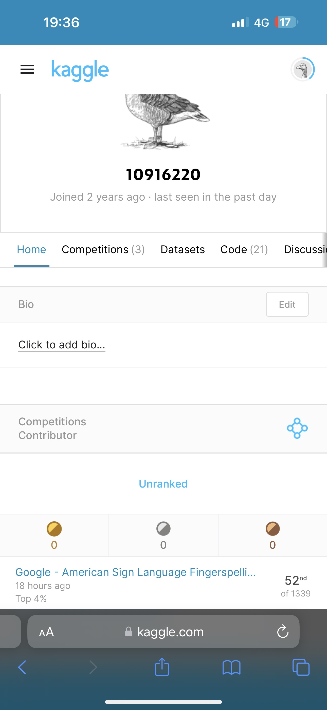
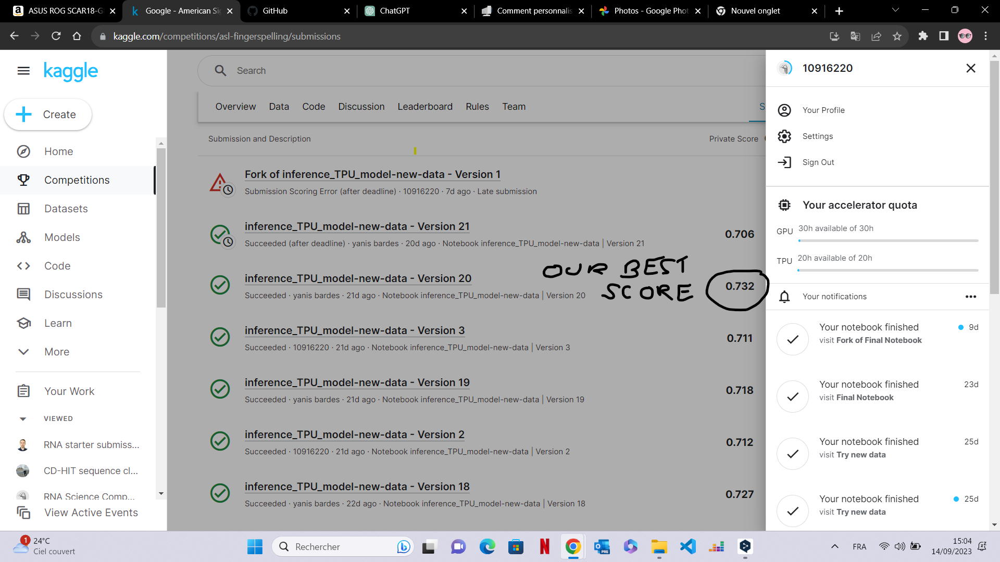
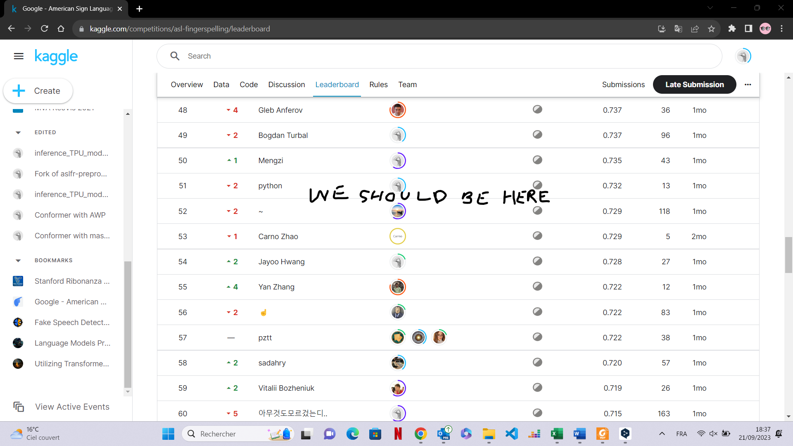

# Kaggle-American-Sign-Language-Fingerspelling-Recognition

# Context

The goal of that competition was to detect and translate American Sign Language (ASL) fingerspelling into text. The data included more than three million fingerspelled characters produced by over 100 Deaf signers, captured via the selfie camera of a smartphone with a variety of backgrounds and lighting conditions.

Link of the competition : https://www.kaggle.com/competitions/asl-fingerspelling

# Our solution

To address the problem posed in this competition, we have chosen to implement a text-to-speech processing model based on an encoder-decoder architecture, using CTC loss (Connectionist Temporal Classification loss) as the loss function. For a better understanding, let's take a look at CTC loss and the Conformer architecture.

CTC loss (Connectionist Temporal Classification loss) is a cost function commonly used in automatic speech recognition tasks, notably in speech-to-text conversion (ASR). This loss function enables audio and text sequences to be aligned efficiently, even when the lengths of these sequences do not match perfectly. It is particularly useful in situations where there may be missing, repeated or mispronounced phonemes or words in speech.

CTC loss works by creating an assumption of correspondence between the input audio sequence and the output text sequence by inserting special symbols called "blanks". These "blanks" model flexible alignments between spoken phonemes and written words. CTC loss then optimizes this correspondence by maximizing the probability of correct labels for each time frame in the audio sequence.

As for the Conformer architecture, it is renowned for its ability to effectively combine convolution layers and attention mechanisms (multi-headed attention) to manage temporal and spatial data in the context of automatic speech recognition. This architecture is designed to exploit the advantages of these different components to deliver state-of-the-art performance in speech-to-text conversion, while avoiding the use of LSTM networks.

The idea of using this loss and this architecture came to us while browsing the state of the art concerning audio speech to text recognition tasks, as there is a clear analogy between this theme and the competition, which is verified by our solution and the solutions in the top 5 of the competition.

# About our ranking 

Our team consisted of 3 members, Yanis Bardes, Jeremy Ling and myself. We gave it our all in this competition and managed to place 52nd out of 1339 on the day the competition closed, representing the top 4% and a silver medal, which is very respectable for a first public competition on Kaggle. However, after closing, our medals were not available and 2 days after closing, we discovered that our team had been banned from the competition, like 24 others apparently (cause on the actual leaderbord, 1 315 teams remained), without any warning. In fact, one of my colleagues used a second account to submit to the competition, as he was desperate to test a model configuration on the last day, when we had no submissions left. This last submission lifted his second account to 51st place, which virtually put us 2 places off the leaderboard. After talking to Kaggle, they were able to confirm that this was the reason for our ban... We've obviously apologized to Kaggle, and for our next competitions, we'll try to respect all the platform's rules. Here are a few screenshots justifying our ranking, which is no longer visible on the public leaderboard.

In this repository, you can fing our training and inference code. You can also find our data pre-processing code here.

We want to thank kaggle and google for this competition, and also thank the other competitors, some of whom have published very interesting notebooks, some of whose ideas we have taken up, particularly in the area of data pre-processing.
